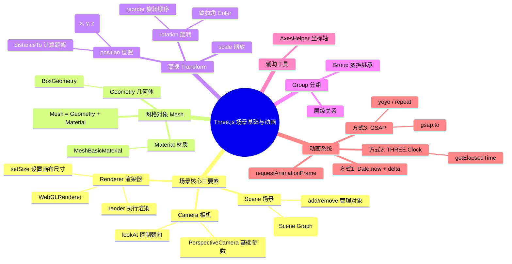

# Ch01 — 场景基础与动画系统

## 思维导图



---

## 1. 场景核心三要素

Three.js 渲染一帧画面至少需要三个对象：**Scene（场景）**、**Camera（相机）** 和 **Renderer（渲染器）**。

### 1.1 Scene

`Scene` 是所有 3D 对象的容器，也是场景图（Scene Graph）的根节点。所有要显示的对象都必须通过 `scene.add()` 添加到场景中。

```ts
// 来自 ch01/src/main.ts
const scene = new T.Scene();
```

> **发散思考**：Scene 本身也是一个 `Object3D`，因此它也拥有 `position`、`rotation`、`scale` 属性。虽然通常不会移动整个场景，但在某些需要做全局偏移的情况下（如切换关卡时整体平移场景），这个特性非常有用。

### 1.2 Camera

相机决定了我们从哪个角度、以什么视角观察场景。`PerspectiveCamera` 是最常见的透视相机，它模拟人眼的透视效果——近大远小。

```ts
// 参数：fov(视场角), aspect(宽高比)
const camera = new T.PerspectiveCamera(75, sizes.width / sizes.height);
camera.position.z = 3;
scene.add(camera);
```

- **fov**：垂直方向的视场角（单位是度），越大看到的范围越广但畸变越严重
- **aspect**：画布宽高比，必须与渲染目标一致否则画面会拉伸
- `camera.lookAt(target)` 可以让相机对准某个点或对象

> **常见问题**：为什么什么都看不到？通常是因为相机在物体内部、朝向错误，或者 near/far 裁剪平面没有包含物体。

### 1.3 Renderer

渲染器负责将场景和相机的信息计算为最终的像素图像并绘制到 Canvas 上。

```ts
const renderer = new T.WebGLRenderer({ canvas });
renderer.setSize(sizes.width, sizes.height);

// 渲染一帧
renderer.render(scene, camera);
```

> **应用场景**：在 VR/AR 项目中，通常会使用 `WebXRManager` 配合渲染器；在离屏渲染（如生成缩略图）中可以使用 `WebGLRenderTarget`。

---

## 2. 网格对象 Mesh

`Mesh` 是 Three.js 中最常见的可渲染对象，由 **Geometry（几何体）** 和 **Material（材质）** 组合而成。

```ts
const geometry = new T.BoxGeometry(1, 1, 1);
const material = new T.MeshBasicMaterial({ color: 0xff0000 });
const mesh = new T.Mesh(geometry, material);
scene.add(mesh);
```

- `BoxGeometry(width, height, depth)` 创建一个长方体
- `MeshBasicMaterial` 是最简单的材质，不受光照影响

> **发散思考**：Geometry 和 Material 是可以复用的。如果场景中有 100 个相同形状、相同颜色的物体，只需要创建一份 Geometry 和一份 Material，然后创建 100 个 Mesh 共享它们即可。这比创建 100 份独立的 Geometry 和 Material 节省大量内存。

---

## 3. 变换 Transform

每个 `Object3D`（包括 Mesh、Group、Camera 等）都有三种基础变换属性。

### 3.1 Position（位置）

```ts
// 单独设置
mesh.position.x = 0.7;
mesh.position.y = -0.6;
mesh.position.z = 1;

// 一次性设置
mesh.position.set(0.7, -0.6, 1);

// 计算两点间距离
console.log(mesh.position.distanceTo(camera.position));
```

### 3.2 Rotation（旋转）

Three.js 默认使用欧拉角（Euler Angles），旋转顺序默认是 XYZ。

```ts
// 改变旋转顺序（必须在设置旋转值之前调用）
mesh.rotation.reorder("YXZ");
mesh.rotation.x = Math.PI / 4;
mesh.rotation.y = Math.PI / 4;
```

> **万向锁问题**：欧拉角在某些旋转组合下会出现"万向锁"（Gimbal Lock），导致丢失一个自由度。对于需要频繁或复杂旋转的场景（如飞行模拟器），建议使用 `Quaternion`（四元数）代替欧拉角。

### 3.3 Scale（缩放）

```ts
mesh.scale.x = 2;
mesh.scale.y = 0.5;
mesh.scale.z = 0.5;
```

---

## 4. Group（分组）

`Group` 可以将多个对象组织在一起，对 Group 应用的变换会自动传递给所有子对象。

```ts
const group = new T.Group();
group.position.y = 1;
scene.add(group);

const cube1 = new T.Mesh(new T.BoxGeometry(1, 1, 1), new T.MeshBasicMaterial({ color: 0xff0000 }));
group.add(cube1);
```

> **应用场景**：构建机器人手臂时，可以用 Group 嵌套表示关节层级：肩部 Group → 上臂 Group → 肘部 Group → 前臂 Group。旋转肩部时，整条手臂都会跟着旋转。

---

## 5. 辅助工具 AxesHelper

`AxesHelper` 在原点绘制三条彩色线段，帮助辨别坐标方向：

- **红色 (R)** = X 轴
- **绿色 (G)** = Y 轴
- **蓝色 (B)** = Z 轴

```ts
const axisHelper = new T.AxesHelper(2); // 参数为轴线长度
scene.add(axisHelper);
```

---

## 6. 动画系统

Three.js 的动画本质上是在每一帧更新对象属性，然后重新渲染。项目中展示了三种实现方式。

### 方式 1：手动计算时间差 (Date.now)

```ts
let time = Date.now();

const tick = () => {
  const current = Date.now();
  const delta = current - time; // 两帧之间的时间差（毫秒）
  time = current;

  group.rotation.y += delta * 0.001; // 基于时间差的匀速旋转

  renderer.render(scene, camera);
  requestAnimationFrame(tick);
};
```

**核心思路**：通过 `delta` 补偿帧率波动，确保动画在 30fps 和 60fps 的设备上看起来速度一致。

### 方式 2：THREE.Clock

```ts
const clock = new T.Clock();

const tick = () => {
  const elapsedTime = clock.getElapsedTime(); // 从创建 Clock 起经过的秒数

  // 圆周运动
  camera.position.x = Math.cos(elapsedTime) * 3;
  camera.position.y = Math.sin(elapsedTime) * 3;
  camera.lookAt(group.position);

  renderer.render(scene, camera);
  requestAnimationFrame(tick);
};
```

**优势**：`getElapsedTime()` 返回的是"绝对时间"，适合做基于三角函数的周期运动（圆形轨道、正弦波等）。

### 方式 3：GSAP 动画库

```ts
gsap.to(group.position, {
  duration: 1,
  x: 2,
  repeatDelay: 0.1,
  yoyo: true,   // 往返运动
  repeat: -1,   // 无限重复
});

const tick = () => {
  renderer.render(scene, camera);
  requestAnimationFrame(tick);
};
```

**优势**：GSAP 提供了丰富的缓动函数（ease）、时间线（Timeline）和回调，适合做复杂的交互动画。与手动计算相比代码更简洁、更声明式。

> **发散思考**：三种方式如何选择？
> - **简单的持续旋转/匀速运动** → Clock
> - **需要缓动、延迟、序列动画** → GSAP
> - **需要精确的帧同步物理模拟** → Date.now + delta

---

## 7. 相关面试/思考题

1. **Scene 和 Group 有什么区别？** Scene 是 Group 的子类，额外提供了 `background`、`fog`、`environment` 等场景级属性。
2. **requestAnimationFrame 和 setInterval 有什么区别？** rAF 与浏览器刷新率同步（通常 60fps），在标签页不可见时自动暂停；setInterval 无视刷新率且持续运行。
3. **为什么动画循环中 `renderer.render()` 必须放在属性更新之后？** 因为 render 会读取当前帧的所有对象状态进行绘制，如果在更新前渲染，画面将延迟一帧。
