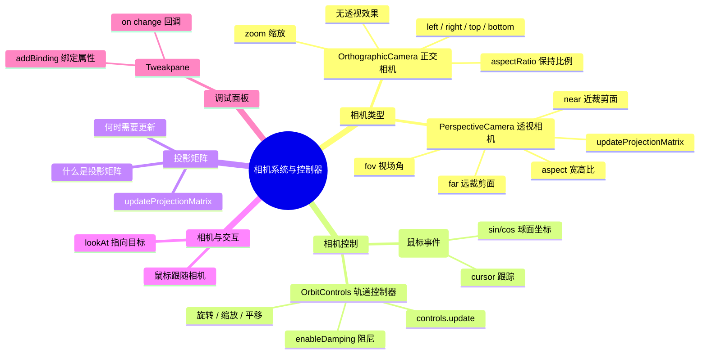

# Ch06 — 相机系统与轨道控制

## 思维导图



---

## 1. 透视相机 PerspectiveCamera

透视相机模拟人眼视觉——近大远小，是 3D 场景中最常用的相机类型。

```ts
// 来自 ch06/src/main.ts
const camera = new T.PerspectiveCamera(
  75,                              // fov: 垂直视场角(度)
  sizes.width / sizes.height,      // aspect: 宽高比
  0.1,                             // near: 近裁剪面
  100                              // far: 远裁剪面
);
```

### 四个关键参数

| 参数 | 说明 | 建议值 |
|------|------|--------|
| **fov** | 垂直视场角，越大视野越广但畸变越重 | 45–75 |
| **aspect** | 画布宽/高，不匹配会导致拉伸 | `canvas.width / canvas.height` |
| **near** | 比这更近的物体不会被渲染 | 0.1（不要设成 0） |
| **far** | 比这更远的物体不会被渲染 | 100–1000 |

> **常见陷阱**：`near` 设为 0.0001、`far` 设为 100000 会导致 **Z-fighting**（深度冲突），因为深度缓冲区的精度是有限的，范围越大精度越低。应该尽量缩小 near/far 的范围。

### 动态调整 FOV

通过 Tweakpane 可以实时调节视场角，但修改后必须调用 `updateProjectionMatrix()` 使变更生效：

```ts
pane.addBinding(camera, "fov", { min: 1, max: 150, step: 0.1 }).on("change", () => {
  camera.updateProjectionMatrix();
});
```

---

## 2. 正交相机 OrthographicCamera

正交相机没有透视效果，远近物体大小一致，常用于 2D 游戏、工程图纸、UI 覆盖层。

```ts
// 保持纵横比一致
const aspectRatio = sizes.width / sizes.height;
const camera = new T.OrthographicCamera(
  -aspectRatio,  // left
  aspectRatio,   // right
  1,             // top
  -1,            // bottom
  0.1,           // near
  100            // far
);
```

### 为什么要用 aspectRatio？

如果直接写 `(-1, 1, 1, -1)`，正交视锥体是正方形的，在宽屏显示器上画面会被水平压缩。乘以 `aspectRatio` 可以让视锥体与画布比例一致。

> **应用场景对比**：
> - **透视相机**：3D 游戏、建筑可视化、产品展示
> - **正交相机**：2D 横版游戏、地图编辑器、小地图(Minimap)、CAD 视图

---

## 3. 手动实现鼠标控制相机

在引入 OrbitControls 之前，可以通过鼠标事件手动控制相机在球面上的位置：

```ts
const cursor = { x: 0, y: 0 };
window.addEventListener("mousemove", (evt) => {
  cursor.x = evt.clientX / sizes.width - 0.5;   // 归一化到 [-0.5, 0.5]
  cursor.y = -(evt.clientY / sizes.height - 0.5); // Y 轴反转
});

const tick = () => {
  // 利用三角函数将平面坐标映射到球面
  camera.position.x = Math.sin(cursor.x * Math.PI * 2) * 3;
  camera.position.z = Math.cos(cursor.x * Math.PI * 2) * 3;
  camera.position.y = cursor.y * 5;
  camera.lookAt(group.position);

  renderer.render(scene, camera);
  requestAnimationFrame(tick);
};
```

**原理**：将鼠标水平位移映射为球坐标的角度（0 ~ 2π），通过 `sin/cos` 计算出相机在 XZ 平面上的圆形轨道位置。

> **发散思考**：为什么 `cursor.y` 取反？因为屏幕坐标系 Y 轴向下为正，而 Three.js 世界坐标系 Y 轴向上为正。

---

## 4. OrbitControls 轨道控制器

`OrbitControls` 是 Three.js 官方提供的控制器，实现了围绕目标点的旋转、缩放和平移功能。

```ts
import { OrbitControls } from "three/examples/jsm/controls/OrbitControls.js";

const controls = new OrbitControls(camera, canvas);
controls.enableDamping = true; // 开启阻尼/惯性

const tick = () => {
  controls.update(); // ⚠️ 开启 damping 后必须每帧调用
  renderer.render(scene, camera);
  requestAnimationFrame(tick);
};
```

### 交互操作

| 操作 | 鼠标 | 触控 |
|------|------|------|
| **旋转** | 左键拖拽 | 单指拖拽 |
| **缩放** | 滚轮 | 双指缩放 |
| **平移** | 右键拖拽 | 三指拖拽 |

### enableDamping（阻尼）

开启后，松开鼠标时相机不会立即停止，而是有一个减速过程，使操作更丝滑自然。**注意**：开启 damping 后必须在动画循环中调用 `controls.update()`，否则阻尼效果不会生效。

### 常用配置

```ts
controls.enableDamping = true;       // 阻尼
controls.dampingFactor = 0.05;       // 阻尼系数
controls.enableZoom = true;          // 允许缩放
controls.enablePan = true;           // 允许平移
controls.minDistance = 1;            // 最小缩放距离
controls.maxDistance = 50;           // 最大缩放距离
controls.maxPolarAngle = Math.PI / 2; // 限制垂直旋转角度(不能翻到地下)
controls.target.set(0, 1, 0);       // 设置围绕的目标点
```

> **应用场景**：产品 360° 展示、模型预览、场景巡览。对于第一人称控制，应该使用 `PointerLockControls`；飞行模拟使用 `FlyControls`。

---

## 5. 投影矩阵 updateProjectionMatrix

相机的投影矩阵（Projection Matrix）决定了 3D 空间如何映射到 2D 屏幕。当修改以下属性后，**必须**调用 `camera.updateProjectionMatrix()`：

- `fov` / `aspect` / `near` / `far`（透视相机）
- `left` / `right` / `top` / `bottom` / `zoom`（正交相机）

```ts
// 窗口大小变化时
camera.aspect = sizes.width / sizes.height;
camera.updateProjectionMatrix();
```

> **为什么不自动更新？** 性能考虑。矩阵计算有一定开销，Three.js 选择让开发者在"需要时"手动触发，避免每帧不必要的重复计算。

---

## 6. 相关面试/思考题

1. **透视相机和正交相机的核心数学区别是什么？** 透视投影矩阵会将视锥体（梯形）映射为标准立方体，距离越远收缩越大；正交投影矩阵直接将长方体映射为标准立方体，不产生近大远小效果。
2. **为什么 OrbitControls 要从 `three/examples/jsm/` 导入而不是直接从 `three` 导入？** 因为它不是核心库的一部分，而是社区维护的附加模块（addons），保持核心包精简。
3. **如何在不使用 OrbitControls 的情况下实现相机平滑跟随目标物体？** 在动画循环中用 `lerp`（线性插值）逐步将相机位置/朝向趋近目标，例如 `camera.position.lerp(targetPos, 0.05)`。
