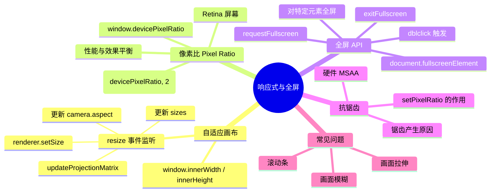

# Ch07 — 响应式设计与全屏

## 思维导图



---

## 1. 自适应画布尺寸

默认情况下 Three.js 画布是固定大小的，当浏览器窗口改变时画面不会自动适应。正确的做法是监听 `resize` 事件并同步更新三个部分：

```ts
// 来自 ch07/src/main.ts
const sizes = {
  width: window.innerWidth,
  height: window.innerHeight,
};

window.addEventListener("resize", () => {
  // 1. 更新尺寸记录
  sizes.width = window.innerWidth;
  sizes.height = window.innerHeight;

  // 2. 更新相机宽高比 + 重建投影矩阵
  camera.aspect = sizes.width / sizes.height;
  camera.updateProjectionMatrix();

  // 3. 更新渲染器输出尺寸
  renderer.setSize(sizes.width, sizes.height);

  // 4. 更新像素比（应对设备热插拔外接显示器等场景）
  renderer.setPixelRatio(Math.min(window.devicePixelRatio, 2));
});
```

### 为什么需要同时更新这三处？

| 步骤 | 不更新会怎样 |
|------|------------|
| `camera.aspect` | 画面被拉伸或压缩 |
| `updateProjectionMatrix()` | aspect 修改不生效 |
| `renderer.setSize()` | Canvas 大小不变，画面与窗口不匹配 |

> **发散思考**：在嵌入式场景（Canvas 不是全屏而是在 div 容器中）中，应该使用 `ResizeObserver` 监听容器元素尺寸变化，而不是监听 `window.resize`。

---

## 2. 像素比 (Pixel Ratio)

### 什么是像素比？

`devicePixelRatio` 表示一个 CSS 像素对应多少个物理像素：

- **1** = 标准屏幕（1 CSS px = 1 物理 px）
- **2** = Retina 屏幕（1 CSS px = 4 物理 px）
- **3** = 部分高端手机（1 CSS px = 9 物理 px）

如果不处理像素比，Three.js 在高分屏上渲染的分辨率是标准分辨率，画面看起来会模糊。

### 设置像素比

```ts
// 设置上限为 2，超过 2 性能消耗增大但肉眼差异不明显
renderer.setPixelRatio(Math.min(window.devicePixelRatio, 2));
```

### 为什么限制为 2？

| 像素比 | 实际渲染像素数（1920×1080 画布） | 相对性能消耗 |
|--------|-------------------------------|------------|
| 1 | 1920 × 1080 = 2M | 1× |
| 2 | 3840 × 2160 = 8M | 4× |
| 3 | 5760 × 3240 = 18M | 9× |

像素比从 2 到 3，渲染量翻了 2.25 倍，但人眼几乎察觉不到差异。因此 `Math.min(devicePixelRatio, 2)` 是业界公认的最佳实践。

> **应用场景**：在移动端设备上，有些旗舰手机的像素比高达 3.5。如果不加限制，一个全屏 Three.js 应用可能需要渲染超过 2000 万像素每帧，导致严重卡顿和发热。

---

## 3. 全屏 API

HTML5 Fullscreen API 允许将特定元素（而不仅是整个页面）全屏显示。

```ts
// 来自 ch07/src/main.ts
window.addEventListener("dblclick", () => {
  if (document.fullscreenElement) {
    document.exitFullscreen();
  } else {
    canvas?.requestFullscreen(); // 仅将 Canvas 全屏
  }
});
```

### 关键 API

| API | 说明 |
|-----|------|
| `element.requestFullscreen()` | 使元素进入全屏模式 |
| `document.exitFullscreen()` | 退出全屏 |
| `document.fullscreenElement` | 当前全屏元素（无则为 `null`） |
| `fullscreenchange` 事件 | 全屏状态变化时触发 |

### 为什么对 Canvas 全屏而不是 document？

对特定元素全屏可以避免页面其他 UI 元素干扰 3D 视图，且浏览器的地址栏和工具栏也会隐藏，提供沉浸式体验。

> **兼容性注意**：部分旧版浏览器需要使用带前缀的 API（如 `webkitRequestFullscreen`）。建议使用 `screenfull.js` 等库处理兼容性。

---

## 4. CSS 配合

为了让 Canvas 完全填满窗口且不出现滚动条，需要配合 CSS：

```css
/* 去除默认间距和滚动条 */
* {
  margin: 0;
  padding: 0;
}
html, body {
  overflow: hidden;
}
canvas {
  display: block; /* 去除 inline 元素默认的底部空白 */
}
```

> **常见问题**：Canvas 右侧或底部出现几像素的空白/滚动条？通常是因为 Canvas 默认是 `inline` 元素，设置 `display: block` 即可解决。

---

## 5. 相关面试/思考题

1. **在 React/Vue 中如何处理 Three.js Canvas 的响应式？** 使用 `useEffect` / `onMounted` + `ResizeObserver` 监听容器元素大小变化，在回调中更新相机和渲染器。
2. **为什么有时候全屏后画面变模糊了？** 进入全屏后分辨率可能改变，需要在 `fullscreenchange` 事件中重新调用 `renderer.setSize()` 和 `setPixelRatio()`。
3. **如何实现画布在页面中自适应但保持固定宽高比（如 16:9）？** 计算容器的最大可用尺寸，按 16:9 算出宽高，居中放置 Canvas。
