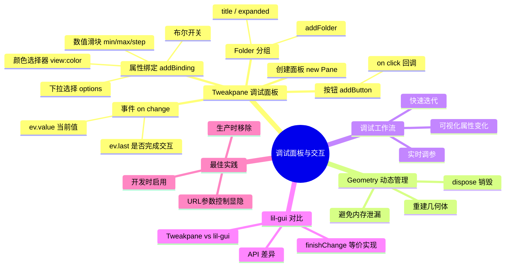

# Ch09 — 调试面板与交互控制

## 思维导图



---

## 1. 为什么需要调试面板

在 3D 开发中，很多参数（位置、颜色、材质属性等）需要反复调整才能达到理想效果。如果每次修改都要改代码、刷新页面，效率极低。调试面板（Debug UI）提供了**实时可视化调参**的能力。

> **项目中的实践**：ch09 使用 Tweakpane 实现了对立方体位置、可见性、线框模式、颜色、旋转动画和几何体细分段数的实时控制。

---

## 2. Tweakpane 基础用法

### 创建面板与文件夹

```ts
// 来自 ch09/src/main.ts
import { Pane } from "tweakpane";

const pane = new Pane();
const cubeFolder = pane.addFolder({
  title: "Cube控制",
});
```

### 属性绑定

Tweakpane 的核心是 `addBinding`——将 JS 对象的属性与 UI 控件双向绑定。

#### 数值滑块

```ts
cubeFolder.addBinding(mesh.position, "y", {
  min: -3,
  max: 3,
  label: "Y方向",
});
```

#### 布尔开关

```ts
cubeFolder.addBinding(mesh, "visible");
cubeFolder.addBinding(material, "wireframe");
```

#### 颜色选择器

```ts
const colorObject = {
  color: "#" + material.color.getHexString(),
};

cubeFolder
  .addBinding(colorObject, "color", {
    picker: "inline",
    expanded: true,
    view: "color",
  })
  .on("change", (ev) => {
    material.color.set(ev.value);
  });
```

> **注意**：Three.js 的 `Color` 对象不能直接绑定到 Tweakpane，需要通过中间对象桥接。修改颜色后通过 `material.color.set()` 同步回 Three.js。

#### 按钮

```ts
cubeFolder
  .addButton({ title: "Rotation" })
  .on("click", () => {
    gsap.to(mesh.rotation, {
      duration: 1,
      y: mesh.rotation.y + Math.PI * 2,
    });
  });
```

---

## 3. 处理"完成交互"事件

某些操作（如重建几何体）不应在滑块拖动过程中频繁触发，而应等用户松开鼠标后才执行。

```ts
cubeFolder
  .addBinding({ subdivision: 2 }, "subdivision", {
    min: 1, max: 10, step: 1,
  })
  .on("change", (ev) => {
    // ev.last 表示用户是否完成了本次交互
    if (ev.last) {
      mesh.geometry.dispose(); // 销毁旧几何体
      mesh.geometry = new T.BoxGeometry(1, 1, 1, ev.value, ev.value, ev.value);
    }
  });
```

### ev.last 的作用

| `ev.last` | 含义 | 用途 |
|-----------|------|------|
| `false` | 用户仍在拖动滑块 | 适合做实时预览（如颜色变化） |
| `true` | 用户松开了鼠标 | 适合做重型操作（如重建几何体） |

> **对比 lil-gui**：lil-gui（Three.js Journey 课程中常用的调试库）使用 `onChange` 和 `onFinishChange` 两个回调来区分。Tweakpane 统一使用 `on("change")` + `ev.last` 标记。

---

## 4. Geometry 的 dispose() 与内存管理

Three.js 中的几何体和材质不会被 JavaScript 垃圾回收器自动清理，因为它们关联了 GPU 资源（缓冲区、纹理等）。手动调用 `dispose()` 是防止内存泄漏的关键。

```ts
mesh.geometry.dispose(); // 释放 GPU 缓冲区
mesh.geometry = new T.BoxGeometry(1, 1, 1, ev.value, ev.value, ev.value);
```

### 需要 dispose 的对象

| 对象类型 | dispose 方法 | 释放的资源 |
|----------|-------------|-----------|
| `BufferGeometry` | `geometry.dispose()` | 顶点缓冲区 |
| `Material` | `material.dispose()` | 着色器程序 |
| `Texture` | `texture.dispose()` | GPU 纹理内存 |
| `RenderTarget` | `target.dispose()` | 帧缓冲区 |

> **发散思考**：在 SPA（单页应用）中切换页面时，如果不正确 dispose Three.js 资源，GPU 内存会持续增长。可以使用 `renderer.info` 监控当前的几何体、纹理和 draw call 数量。

---

## 5. Tweakpane vs lil-gui

| 特性 | Tweakpane | lil-gui |
|------|-----------|---------|
| 包体积 | ~30KB | ~15KB |
| 类型支持 | 原生 TypeScript | 需要 @types |
| 颜色选择器 | 内联/弹出可选 | 弹出式 |
| 图表/监控 | 内置 FPS 监控 | 无 |
| 文件夹嵌套 | 支持 | 支持 |
| 插件生态 | 丰富（旋转、间隔等） | 有限 |
| "完成变化"回调 | `ev.last` | `onFinishChange` |

---

## 6. 最佳实践

### 开发/生产分离

```ts
// 通过 URL 参数控制调试面板显隐
const showDebug = window.location.hash === "#debug";
if (showDebug) {
  const pane = new Pane();
  // ... 添加控件
}
```

### 组织结构

- 用 **Folder** 按功能分组（光照、材质、相机等）
- 为每个绑定添加清晰的 **label**
- 重型操作使用 `ev.last` 延迟触发

---

## 7. 相关面试/思考题

1. **为什么需要在重建几何体前调用 dispose？** 旧几何体的 GPU 缓冲区不会自动释放。如果只是替换引用而不 dispose，GPU 内存会持续增长，最终导致 WebGL context lost。
2. **如何在生产环境中完全移除调试面板代码？** 使用 tree-shaking 配合条件导入，或使用 Vite 的 `define` 功能设置环境变量在构建时剔除。
3. **Three.js 的 Color 对象为什么不能直接作为 Tweakpane 的绑定目标？** 因为 Three.js 的 Color 存储的是 0–1 范围的 RGB 浮点值，而 Tweakpane 的颜色控件期望的是 hex 字符串或 CSS 颜色值。
