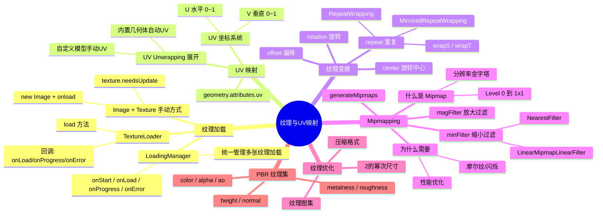

# Ch10 — 纹理加载与 UV 映射

## 思维导图



---

## 1. 纹理加载方式

### 方式 1：Image + Texture（手动方式）

```ts
const image = new Image();
const texture = new T.Texture(image);
image.onload = () => {
  texture.needsUpdate = true; // 告知 Three.js 图片已就绪，需要上传 GPU
};
image.src = "/textures/door/color.jpg";
```

### 方式 2：TextureLoader（推荐）

```ts
// 来自 ch10/src/main.ts
const textureLoader = new T.TextureLoader(loadingManager);
const colorTexture = textureLoader.load("/textures/door/color.jpg");
```

### LoadingManager（统一管理）

当需要加载多张纹理并跟踪整体进度时，使用 `LoadingManager`：

```ts
const loadingManager = new T.LoadingManager();

loadingManager.onStart = () => { console.log("开始加载"); };
loadingManager.onLoad = () => { console.log("全部加载完成"); };
loadingManager.onProgress = () => { console.log("加载中..."); };
loadingManager.onError = () => { console.log("加载出错"); };

const textureLoader = new T.TextureLoader(loadingManager);
// 通过同一个 loader 加载的所有纹理都会被 manager 跟踪
```

> **应用场景**：实现加载进度条。在 `onProgress` 回调中更新 UI 进度，在 `onLoad` 中隐藏加载界面并启动场景。

---

## 2. UV 映射

### UV 坐标系统

UV 是 2D 纹理空间的坐标系统：
- **U** = 水平方向（0 = 左, 1 = 右）
- **V** = 垂直方向（0 = 下, 1 = 上）

每个顶点除了 3D 位置 (x, y, z) 外，还有 2D 纹理坐标 (u, v)，告诉渲染引擎"这个顶点对应图片的哪个位置"。

### UV Unwrapping（UV 展开）

UV 展开就是把 3D 模型表面"拆开铺平"到 2D 平面的过程，类似于拆纸盒、剥橘子皮。

- **内置几何体**（BoxGeometry、SphereGeometry 等）已包含预计算的 UV 坐标
- **自定义模型** 需要在 Blender 等建模软件中手动标记接缝(Seams)并展开

```ts
const geometry = new T.BoxGeometry(1, 1, 1);
console.log(geometry.attributes.uv); // 可以看到每个顶点的 UV 坐标
```

> **BoxGeometry 的 UV 特点**：每个面独立映射整张纹理 (0,0) 到 (1,1)，因此六个面会各显示一份完整的图片。

---

## 3. 纹理变换

### 重复（repeat）

```ts
colorTexture.repeat.x = 2; // 水平重复 2 次
colorTexture.repeat.y = 3; // 垂直重复 3 次
// 必须设置包裹模式，否则重复不生效
colorTexture.wrapS = T.RepeatWrapping;   // S = U(水平)
colorTexture.wrapT = T.RepeatWrapping;   // T = V(垂直)
```

### 包裹模式

| 模式 | 效果 |
|------|------|
| `ClampToEdgeWrapping`（默认） | 边缘像素被拉伸填充 |
| `RepeatWrapping` | 纹理平铺重复 |
| `MirroredRepeatWrapping` | 镜像翻转重复 |

### 偏移（offset）

```ts
colorTexture.offset.x = 0.5; // 水平偏移 50%
colorTexture.offset.y = 0.5; // 垂直偏移 50%
```

### 旋转（rotation）

```ts
colorTexture.rotation = Math.PI * 0.25; // 旋转 45°
colorTexture.center.x = 0.5; // 旋转中心 X
colorTexture.center.y = 0.5; // 旋转中心 Y
```

> **注意**：默认旋转中心是 (0, 0)（左下角），设置 `center` 为 (0.5, 0.5) 使其围绕纹理中心旋转。

---

## 4. Mipmapping（多级渐远纹理）

### 原理

Mipmapping 预生成一系列分辨率逐渐减半的纹理版本（金字塔）：

```
Level 0: 1024×1024（原始）
Level 1: 512×512
Level 2: 256×256
...
Level 10: 1×1
```

GPU 根据物体在屏幕上的大小自动选择合适的层级。

### 为什么需要 Mipmapping？

1. **消除摩尔纹**：远处物体不会因采样频率不足而出现闪烁
2. **提升性能**：远处物体使用低分辨率纹理，减少 GPU 带宽消耗

### 过滤器设置

```ts
// 关闭 mipmap 生成（如果使用 NearestFilter 可以关闭以节省内存）
colorTexture.generateMipmaps = false;

// 缩小过滤器（物体远离时）
colorTexture.minFilter = T.NearestFilter;

// 放大过滤器（物体靠近时）
colorTexture.magFilter = T.NearestFilter;
```

### 过滤器类型

| 过滤器 | 效果 | 适用场景 |
|--------|------|---------|
| `NearestFilter` | 最近邻采样，像素风 | Minecraft 风格、像素画 |
| `LinearFilter` | 线性插值，平滑 | 通用，关闭 mipmap 时 |
| `NearestMipmapNearestFilter` | 最近 mip + 最近采样 | — |
| `NearestMipmapLinearFilter` | 两层 mip 插值 + 最近采样 | — |
| `LinearMipmapNearestFilter` | 最近 mip + 线性采样 | — |
| `LinearMipmapLinearFilter`（默认） | 两层 mip 插值 + 线性采样(三线性过滤) | 大多数场景 |

> **Minecraft 效果诀窍**：将 `magFilter` 和 `minFilter` 都设为 `NearestFilter`，低分辨率纹理就会呈现清晰的像素块风格，而不是模糊的插值。

---

## 5. PBR 纹理集

一套完整的 PBR 纹理通常包含以下贴图：

| 贴图 | Three.js 属性 | 说明 |
|------|--------------|------|
| color.jpg | `map` | 基础颜色/反照率 |
| alpha.jpg | `alphaMap` | 透明度（黑透白不透） |
| ambientOcclusion.jpg | `aoMap` | 环境光遮蔽，增加缝隙阴影 |
| height.jpg | `displacementMap` | 高度/位移（实际移动顶点） |
| normal.jpg | `normalMap` | 法线（伪造凹凸细节） |
| metalness.jpg | `metalnessMap` | 金属度 |
| roughness.jpg | `roughnessMap` | 粗糙度 |

---

## 6. 纹理优化建议

1. **尺寸为 2 的幂**：如 512、1024、2048，这样 GPU 可以完美生成 mipmap
2. **控制文件大小**：使用 JPG（有损但小）或 WebP；Alpha 通道用 PNG
3. **纹理图集（Texture Atlas）**：将多张小纹理合并为一张大图，减少 draw call
4. **压缩纹理格式**：如 KTX2/Basis Universal，GPU 可直接解码，大幅节省内存

---

## 7. 相关面试/思考题

1. **为什么纹理尺寸推荐 2 的幂次？** GPU 的 mipmap 生成和纹理寻址硬件针对 2 的幂次做了优化。非 2 的幂纹理（NPOT）在某些 GPU 上不支持 repeat/mipmap。
2. **normalMap 和 displacementMap 有什么区别？** normalMap 只改变光照法线方向（视觉欺骗），不改变实际几何体；displacementMap 真实移动顶点，需要高细分几何体。
3. **如何实现纹理的动态加载和卸载？** 使用 `textureLoader.load()` 按需加载，不再需要时调用 `texture.dispose()` 释放 GPU 内存。
