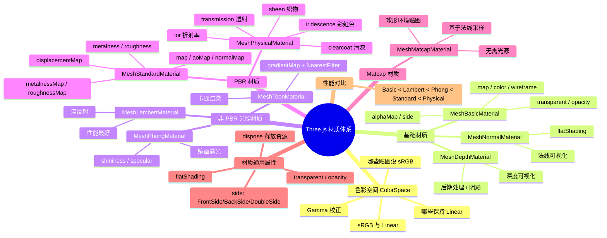

# Ch11 — 材质系统全解

## 思维导图



---

## 1. 色彩空间 (Color Space)

### sRGB vs Linear

```ts
// 来自 ch11/src/main.ts
doorColorTexture.colorSpace = T.SRGBColorSpace;
mapcapTexture.colorSpace = T.SRGBColorSpace;
```

人眼对亮度的感知是非线性的。为了在显示器上看起来"正确"，图片保存时会经过 **Gamma 编码**（sRGB 色彩空间）。Three.js 在渲染时需要将 sRGB 解码为**线性空间**进行光照计算，最后再编码回 sRGB 输出到屏幕。

### 设置规则

| 贴图类型 | 设置 | 原因 |
|----------|------|------|
| `map` (颜色) | `SRGBColorSpace` | 包含人眼可见的颜色 |
| `matcap` | `SRGBColorSpace` | 包含烘焙的颜色和光照 |
| `emissiveMap` | `SRGBColorSpace` | 包含发光颜色 |
| `normalMap` | 保持默认 (Linear) | 存储的是方向向量数据 |
| `roughnessMap` | 保持默认 (Linear) | 存储的是物理参数 (0~1) |
| `metalnessMap` | 保持默认 (Linear) | 存储的是物理参数 |
| `aoMap` | 保持默认 (Linear) | 存储的是遮蔽强度 |

> **不设置会怎样？** 颜色贴图会被当作线性数据处理，渲染结果会发白、偏灰、褪色。

---

## 2. 基础与实用型材质

### MeshBasicMaterial

最简单的材质，**不受光照影响**，直接显示颜色或贴图。

```ts
const basicMat = new T.MeshBasicMaterial({
  map: doorColorTexture,
});
basicMat.transparent = true;
basicMat.alphaMap = doorAlphaTexture; // 白色可见，黑色隐藏
basicMat.side = T.DoubleSide;         // 双面可见
```

- `transparent: true` 必须先开启，`opacity` 和 `alphaMap` 才会生效
- `side` 控制渲染哪一面：`FrontSide`（默认）、`BackSide`、`DoubleSide`

### MeshNormalMaterial

将表面法线映射为 RGB 颜色，常用于调试。

```ts
const normalMat = new T.MeshNormalMaterial();
normalMat.flatShading = true; // 平面着色，每个三角形用同一法线
```

> **flatShading 的作用**：关闭顶点法线插值，使每个三角面片呈现硬边效果。适用于低多边形（Low-Poly）风格的艺术效果。

### MeshDepthMaterial

根据到相机的距离着色（近白远黑），常用于**阴影映射**和**后期处理**（如景深模糊）。

---

## 3. 非 PBR 光照材质

这些材质基于经验模型，计算简单、性能好。

### MeshLambertMaterial

使用 Lambert 反射模型（仅漫反射），是**最省性能**的光照材质。

```ts
const lambertMat = new T.MeshLambertMaterial();
```

> **适用场景**：场景中有大量重复的背景物体时使用，如远处的建筑群、植被等。

### MeshPhongMaterial

在 Lambert 基础上增加了**镜面高光**。

```ts
const phongMat = new T.MeshPhongMaterial();
phongMat.shininess = 100;                    // 高光强度
phongMat.specular = new T.Color("#118ab2"); // 高光颜色
```

### MeshToonMaterial

卡通渲染（Cell Shading），通过 gradientMap 控制色阶数：

```ts
const toonMat = new T.MeshToonMaterial();
gradientTexture.minFilter = T.NearestFilter;  // ⚠️ 必须关闭线性插值
gradientTexture.magFilter = T.NearestFilter;
gradientTexture.generateMipmaps = false;
toonMat.gradientMap = gradientTexture;
```

> **关键细节**：gradientMap 必须使用 `NearestFilter`！如果用默认的线性过滤，颜色过渡会被平滑掉，失去卡通的硬边色阶效果。

---

## 4. PBR 材质

### MeshStandardMaterial

基于物理的渲染材质，使用**金属度/粗糙度**工作流。

```ts
const standardMat = new T.MeshStandardMaterial();
standardMat.metalness = 0.7;
standardMat.roughness = 0.2;
standardMat.map = doorColorTexture;
standardMat.aoMap = doorAmbientOcclusionTexture;
standardMat.aoMapIntensity = 1;
standardMat.displacementMap = doorHeightTexture;
standardMat.displacementScale = 0.1;
standardMat.metalnessMap = doorMetalnessTexture;
standardMat.roughnessMap = doorRoughnessTexture;
standardMat.normalMap = doorNormalTexture;
standardMat.normalScale.set(0.5, 0.5);
```

| 属性 | 说明 | 取值范围 |
|------|------|---------|
| `metalness` | 金属度（0=非金属, 1=金属） | 0–1 |
| `roughness` | 粗糙度（0=镜面, 1=粗糙） | 0–1 |
| `aoMapIntensity` | AO 强度 | 0–∞ |
| `displacementScale` | 位移高度比例 | 0–∞ |
| `normalScale` | 法线凹凸强度 | Vector2 |

### MeshPhysicalMaterial

`MeshStandardMaterial` 的增强版，支持更多物理效果：

```ts
const physicalMat = new T.MeshPhysicalMaterial();

// 清漆效果（汽车漆面、木质光泽）
physicalMat.clearcoat = 1;
physicalMat.clearcoatRoughness = 0.1;

// 织物光泽（丝绸、天鹅绒）
physicalMat.sheen = 1;
physicalMat.sheenRoughness = 0.25;
physicalMat.sheenColor.set(1, 1, 1);

// 彩虹色（肥皂泡、油膜）
physicalMat.iridescence = 1;
physicalMat.iridescenceIOR = 1;
physicalMat.iridescenceThicknessRange = [100, 800];

// 透射（玻璃、水）
physicalMat.transmission = 1;
physicalMat.ior = 1.5;       // 折射率
physicalMat.thickness = 0.5; // 透射厚度
```

> **性能警告**：MeshPhysicalMaterial 是最耗性能的内置材质。每个额外特性（clearcoat、sheen 等）都会增加着色器复杂度。仅在关键物体上使用。

---

## 5. Matcap 材质

`MeshMatcapMaterial` 使用一张球形贴图来伪造完整的光照和材质效果。

```ts
const matcapMat = new T.MeshMatcapMaterial();
matcapMat.matcap = mapcapTexture;
```

### Map vs Matcap 对比

| 特性 | map (基础贴图) | matcap (材质捕获) |
|------|---------------|------------------|
| 包含信息 | 仅颜色/图案 | 颜色+光照+高光+阴影 |
| 映射依据 | UV 坐标 | 相机视角+表面法线 |
| 光源依赖 | 需要光源 | 不需要光源 |
| 旋转表现 | 图案跟着模型转 | 高光随视角流动 |
| 性能 | 取决于材质类型 | 极高（无光照计算） |
| 适用场景 | PBR 工作流 | 模型展示、ZBrush 预览 |

---

## 6. 材质性能对比

| 材质 | 性能 | 视觉 | 推荐场景 |
|------|------|------|---------|
| Basic | ⭐⭐⭐⭐⭐ | 平面 | UI、调试、纯色 |
| Lambert | ⭐⭐⭐⭐ | 柔和 | 大量背景物体 |
| Phong | ⭐⭐⭐ | 有光泽 | 简单反光表面 |
| Toon | ⭐⭐⭐ | 卡通 | 风格化游戏 |
| Standard | ⭐⭐ | 真实 | 通用PBR |
| Physical | ⭐ | 极真实 | 珠宝/汽车展示 |
| Matcap | ⭐⭐⭐⭐ | 伪真实 | 模型浏览器 |

---

## 7. 相关面试/思考题

1. **MeshStandardMaterial 的 metalness 和 roughness 本质上控制了什么？** 它们控制菲涅尔反射率和微表面法线分布。metalness=1 时漫反射为零，所有颜色来自环境反射；roughness=0 时表面完美光滑如镜面。
2. **为什么 Toon 材质的 gradientMap 必须用 NearestFilter？** Toon 风格的核心是离散的色阶过渡。线性过滤会在色阶之间平滑插值，破坏卡通的硬边效果。
3. **如何实现半透明的毛玻璃效果？** 使用 `MeshPhysicalMaterial` + `transmission: 1` + `roughness: 0.5` + `thickness`。
