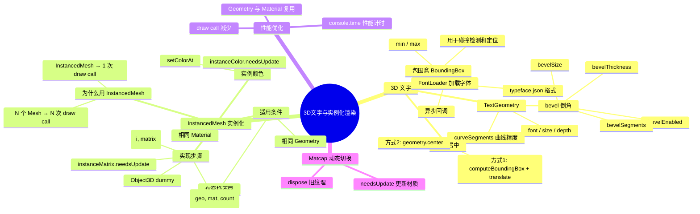

# Ch12 — 3D 文字与 InstancedMesh 优化

## 思维导图



---

## 1. 3D 文字

### 加载字体

Three.js 使用 JSON 格式的字体文件（typeface.json），通过 `FontLoader` 异步加载：

```ts
// 来自 ch12/src/main.ts
import { FontLoader } from "three/examples/jsm/Addons.js";
import { TextGeometry } from "three/addons/geometries/TextGeometry.js";

const fontLoader = new FontLoader();
fontLoader.load("/fonts/helvetiker_regular.typeface.json", (font) => {
  // 字体加载完成后创建 3D 文字
});
```

> **字体来源**：可以在 [gero3/facetype.js](https://gero3.github.io/facetype.js/) 网站将常见字体（TTF/OTF）转换为 Three.js 可用的 typeface.json 格式。

### TextGeometry 参数

```ts
const textGeometry = new TextGeometry("Kobe Bryant", {
  font,
  size: 0.5,           // 文字大小
  depth: 0.2,          // 文字厚度（旧版叫 height）
  curveSegments: 12,   // 曲线精度（越高越圆滑）
  bevelEnabled: true,  // 是否开启倒角
  bevelThickness: 0.03, // 倒角厚度
  bevelSize: 0.02,     // 倒角延伸距离
  bevelOffset: 0,      // 倒角偏移
  bevelSegments: 5,    // 倒角段数
});
```

| 参数 | 说明 | 性能影响 |
|------|------|---------|
| `curveSegments` | 字母曲线的细分段数 | 越大面数越多 |
| `bevelSegments` | 倒角过渡的段数 | 越大越平滑 |
| `depth` | 文字的挤出深度 | 影响面数 |

> **性能提示**：3D 文字的面数非常多。一个带倒角的字母可能有上千个三角形。如果需要大量文字，考虑使用 `Sprite` + 纹理或 `troika-three-text` 库。

### 文字居中

默认情况下 TextGeometry 的原点在左下角。居中需要计算包围盒：

#### 方式 1：手动计算

```ts
textGeometry.computeBoundingBox();
textGeometry.translate(
  -(textGeometry.boundingBox!.max.x + textGeometry.boundingBox!.min.x) * 0.5,
  -(textGeometry.boundingBox!.max.y + textGeometry.boundingBox!.min.y) * 0.5,
  -(textGeometry.boundingBox!.max.z + textGeometry.boundingBox!.min.z) * 0.5,
);
```

#### 方式 2：直接调用 center()

```ts
textGeometry.center(); // 内部已调用 computeBoundingBox()
```

> **包围盒（BoundingBox）** 是一个 `Box3` 对象，包含 `min` 和 `max` 两个 `Vector3`，表示几何体在各轴上的最小和最大坐标。常用于碰撞检测、视锥体裁剪等。

---

## 2. InstancedMesh 实例化渲染

### 问题：大量 Mesh 的性能瓶颈

每个 `Mesh` 都会产生一次 **draw call**（GPU 绘制调用）。100 个独立的 Mesh = 100 次 draw call，CPU 和 GPU 之间的通信开销巨大。

### 解决方案：InstancedMesh

将相同几何体+材质的多个物体合并为**一次 draw call**，只传入不同的变换矩阵。

```ts
// 来自 ch12/src/main.ts
const donutGeometry = new T.TorusGeometry(0.3, 0.2, 20, 45);
const donutCount = 100;
const donutMesh = new T.InstancedMesh(donutGeometry, commonMaterial, donutCount);

const dummy = new T.Object3D();
for (let i = 0; i < donutCount; i++) {
  dummy.position.set(
    (Math.random() - 0.5) * 10,
    (Math.random() - 0.5) * 10,
    (Math.random() - 0.5) * 10,
  );
  dummy.rotation.set(Math.random() * Math.PI, Math.random() * Math.PI, 0);

  const scale = Math.random();
  dummy.scale.set(scale, scale, scale);

  dummy.updateMatrix();                    // 计算变换矩阵
  donutMesh.setMatrixAt(i, dummy.matrix); // 写入第 i 个实例
}
donutMesh.instanceMatrix.needsUpdate = true; // ⚠️ 必须标记更新
scene.add(donutMesh);
```

### 实现步骤

1. 创建共享的 Geometry 和 Material
2. `new T.InstancedMesh(geometry, material, count)` 指定实例数量
3. 用 `Object3D` 作为"临时人偶"设置每个实例的变换
4. `dummy.updateMatrix()` 将 position/rotation/scale 合成为 4×4 矩阵
5. `setMatrixAt(index, matrix)` 写入实例变换
6. `instanceMatrix.needsUpdate = true` 通知 GPU

### 性能对比

| 方式 | 100 个甜甜圈 | 10,000 个甜甜圈 |
|------|-------------|----------------|
| 独立 Mesh | 100 draw calls | 10,000 draw calls（严重卡顿） |
| InstancedMesh | 1 draw call | 1 draw call（流畅） |

### 常见陷阱

- **忘记 `needsUpdate = true`**：矩阵数据不会被上传到 GPU
- **在动画中更新实例矩阵**：每帧修改后都需要重新设置 `needsUpdate = true`
- **实例颜色**：需要 `setColorAt(i, color)` 并设置 `instanceColor.needsUpdate = true`

---

## 3. Geometry 与 Material 复用

项目中特别强调了复用的重要性：

```ts
// ✅ 正确：几何体和材质定义在循环外部，所有实例共享
const donutGeometry = new T.TorusGeometry(0.3, 0.2, 20, 45);
commonMaterial = new T.MeshMatcapMaterial({ matcap: matcapTexture });

// ❌ 错误：每次循环都创建新的几何体和材质
for (let i = 0; i < 100; i++) {
  const geo = new T.TorusGeometry(0.3, 0.2, 20, 45); // 浪费内存！
  const mat = new T.MeshMatcapMaterial();              // 浪费内存！
}
```

---

## 4. Matcap 纹理动态切换

```ts
const applyMatcap = (id: string) => {
  const next = textureLoader.load(`/textures/matcaps/${id}.png`);
  next.colorSpace = T.SRGBColorSpace;

  if (matcapTexture && matcapTexture !== next) matcapTexture.dispose(); // 释放旧纹理
  matcapTexture = next;

  if (!commonMaterial) return;
  commonMaterial.matcap = matcapTexture;
  commonMaterial.needsUpdate = true; // 通知着色器需要重新编译
};
```

> **`needsUpdate = true` 的意义**：当材质的纹理引用发生变化时，需要告诉 Three.js 重新上传纹理到 GPU 并可能重新编译着色器。

---

## 5. 相关面试/思考题

1. **InstancedMesh 和合并几何体（mergeBufferGeometries）有什么区别？** InstancedMesh 保持实例独立可更新变换，合并后的几何体变成一个整体无法单独操控。InstancedMesh 适合动态场景，合并适合静态场景。
2. **如何给每个实例不同颜色？** 使用 `instancedMesh.setColorAt(i, color)`，并确保 `instanceColor.needsUpdate = true`。材质需要支持实例颜色（大多数内置材质都支持）。
3. **3D 文字有哪些替代方案？** `troika-three-text`（基于 SDF 的高性能文字渲染）、`Sprite + CanvasTexture`（将 2D 文字绘制为纹理）、HTML overlay（CSS3D 叠加）。
