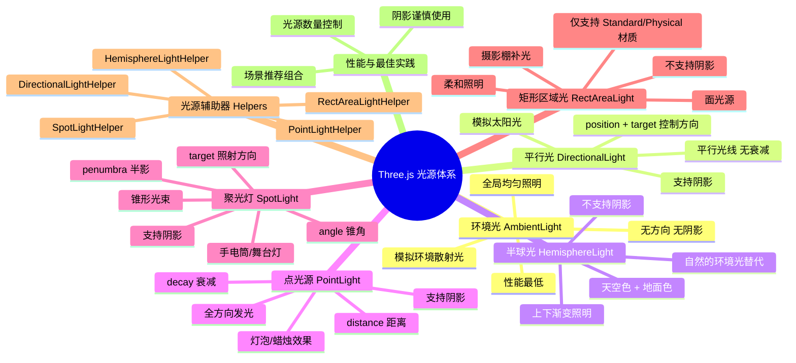

# Ch14 — 光源系统详解

## 思维导图



---

## 1. 环境光 AmbientLight

环境光从**所有方向均匀照亮**场景中的每个物体，不产生阴影和方向感。

```ts
// 来自 ch14/src/main.ts
const ambientLight = new T.AmbientLight(0xffffff, 0.5);
scene.add(ambientLight);
```

| 参数 | 说明 | 默认值 |
|------|------|--------|
| `color` | 光照颜色 | 0xffffff |
| `intensity` | 强度 | 1 |

> **最佳实践**：不要将环境光强度设得过高（通常 0.2–0.5），否则场景失去立体感变得"平"。环境光的作用是补充暗部细节，模拟环境中的多次散射。

---

## 2. 平行光 DirectionalLight

模拟**无限远的平行光源**（如太阳），所有光线方向相同，强度不随距离衰减。

```ts
const directionalLight = new T.DirectionalLight(0x00fffc, 0.3);
directionalLight.position.set(1, 0.25, 0);
scene.add(directionalLight);
```

> **理解方向**：平行光的方向不是由 `position` 单独决定的，而是从 `position` 指向 `target.position`（默认为原点 `(0,0,0)`）的向量。

---

## 3. 半球光 HemisphereLight

模拟天空和地面的双色环境光，上方照射天空色、下方照射地面色，中间自然过渡。

```ts
const hemisphereLight = new T.HemisphereLight(
  0xff0000,  // skyColor 天空色（上方）
  0x0000ff,  // groundColor 地面色（下方）
  1          // intensity
);
scene.add(hemisphereLight);
```

> **应用场景**：户外场景中用天蓝色 + 草绿色可以模拟天空散射+地面反射的自然光效果，比纯 AmbientLight 更有层次感。

---

## 4. 点光源 PointLight

从一个点向**所有方向**发射光线，模拟灯泡、蜡烛等点状光源。

```ts
const pointLight = new T.PointLight(
  0xff9000,  // color
  0.5,       // intensity
  10,        // distance（光照范围，0=无限）
  2          // decay（衰减系数）
);
pointLight.position.set(1, -0.5, 1);
scene.add(pointLight);
```

### 衰减模型

- `distance = 0` 时光线不衰减（不物理但方便）
- `decay = 2` 符合物理世界的平方反比衰减（推荐）
- 光强公式：`intensity / (distance ^ decay)`

---

## 5. 聚光灯 SpotLight

发射锥形光束，模拟手电筒、舞台聚光灯。

```ts
const spotLight = new T.SpotLight(
  0x78ff00,        // color
  4,               // intensity
  10,              // distance
  Math.PI * 0.1,   // angle（锥角，弧度）
  0.25,            // penumbra（半影，0~1）
  1                // decay
);
spotLight.position.set(0, 2, 3);
scene.add(spotLight);

// ⚠️ target 必须加入场景才能正常工作
spotLight.target.position.x = -0.75;
scene.add(spotLight.target);
```

### SpotLight.target

`target` 是一个 `Object3D`，决定聚光灯的照射方向：

- **`spotLight.position`** = 手电筒的位置
- **`spotLight.target.position`** = 手电筒照向哪里
- 必须 `scene.add(spotLight.target)` 确保其矩阵被正常更新

### penumbra（半影）

| 值 | 效果 |
|----|------|
| 0 | 硬边，光锥边缘锐利 |
| 0.5 | 边缘柔化 50% |
| 1 | 从中心到边缘完全渐变 |

---

## 6. 矩形区域光 RectAreaLight

从一个矩形平面发射光线，模拟荧光灯管、LED 面板、摄影棚柔光箱。

```ts
const rectAreaLight = new T.RectAreaLight(
  0x4e00ff,  // color
  20,        // intensity
  1,         // width
  1          // height
);
rectAreaLight.position.set(-1.5, 0.5, 1.5);
rectAreaLight.lookAt(new T.Vector3()); // 朝向原点
scene.add(rectAreaLight);
```

> **重要限制**：RectAreaLight **只对 MeshStandardMaterial 和 MeshPhysicalMaterial 有效**，不支持阴影。

---

## 7. 光源辅助器 Helpers

辅助器以可视化线框的形式显示光源的位置、方向和范围，是调试光照的必备工具。

```ts
// 来自 ch14/src/main.ts
import { RectAreaLightHelper } from "three/examples/jsm/Addons.js";

const hemisphereLightHelper = new T.HemisphereLightHelper(hemisphereLight, 0.2);
const directionalLightHelper = new T.DirectionalLightHelper(directionalLight, 0.2);
const pointLightHelper = new T.PointLightHelper(pointLight, 0.2);
const spotLightHelper = new T.SpotLightHelper(spotLight);
const rectAreaLightHelper = new RectAreaLightHelper(rectAreaLight);

scene.add(hemisphereLightHelper, directionalLightHelper, pointLightHelper,
          spotLightHelper, rectAreaLightHelper);
```

> **注意**：RectAreaLightHelper 需要从 `examples/jsm/` 单独导入，不在核心包中。

---

## 8. 性能排行与场景推荐

### 性能排行（从低到高消耗）

1. **AmbientLight** — 简单颜色叠加
2. **HemisphereLight** — 方向性插值
3. **DirectionalLight** — 方向计算 + 可选阴影
4. **RectAreaLight** — 面光源采样
5. **PointLight** — 距离衰减 + 阴影贴图
6. **SpotLight** — 锥形区域 + 衰减 + 阴影（最贵）

### 场景推荐

| 场景类型 | 推荐组合 |
|----------|---------|
| 户外白天 | AmbientLight + DirectionalLight + HemisphereLight |
| 室内空间 | AmbientLight + PointLight × N + RectAreaLight |
| 舞台效果 | AmbientLight(低) + SpotLight × N |
| 摄影棚 | AmbientLight + RectAreaLight × N |

---

## 9. 相关面试/思考题

1. **为什么 SpotLight.target 需要加入场景？** 因为 Three.js 只会更新场景树中对象的世界矩阵。如果 target 不在场景中，移动 target.position 可能不会正确影响光照方向。
2. **如何用点光源模拟蜡烛闪烁效果？** 在动画循环中随机微调 `pointLight.intensity` 和 `pointLight.position`，配合 `Math.random()` 或 Perlin 噪声。
3. **场景中光源数量有限制吗？** WebGL 着色器的 uniform 数量有限（通常几百个）。Three.js 默认支持最多几个直射光源（数量因材质而异）。超出后需要使用延迟渲染（Deferred Rendering）或烘焙光照（Lightmap）。
