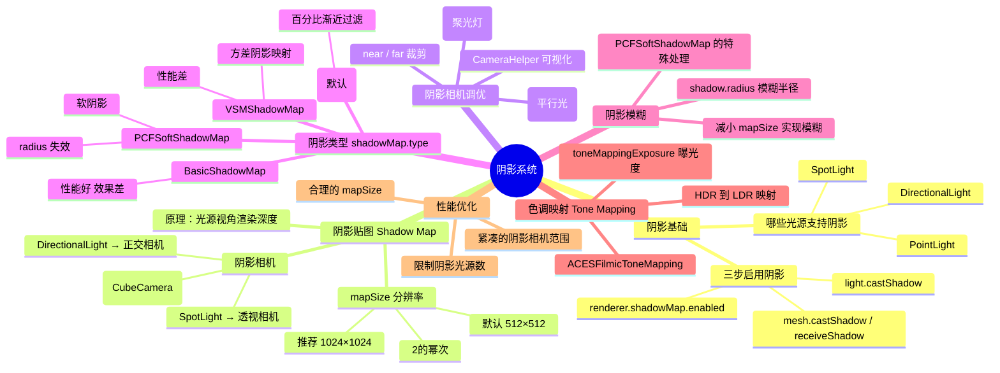

# Ch15 — 阴影系统详解

## 思维导图



---

## 1. 阴影基础

### 支持阴影的光源

并非所有光源都能投射阴影：

| 光源 | 支持阴影 | 阴影相机类型 |
|------|---------|------------|
| AmbientLight | ❌ | — |
| HemisphereLight | ❌ | — |
| **DirectionalLight** | ✅ | 正交相机 |
| **PointLight** | ✅ | 六面透视相机 |
| **SpotLight** | ✅ | 透视相机 |
| RectAreaLight | ❌ | — |

### 启用阴影的三步

```ts
// 来自 ch15/src/main.ts

// 第 1 步：渲染器开启阴影映射
renderer.shadowMap.enabled = true;

// 第 2 步：光源开启阴影投射
directionalLight.castShadow = true;

// 第 3 步：物体设置投射/接收
sphere.castShadow = true;     // 球体投射阴影
plane.receiveShadow = true;   // 地面接收阴影
```

---

## 2. 阴影贴图原理 (Shadow Map)

阴影的计算过程：

1. **从光源视角渲染场景**，生成一张深度图（Shadow Map）
2. **正常渲染时**，将每个片元的位置变换到光源空间
3. **比较深度**：如果片元到光源的距离 > Shadow Map 中记录的深度，则该片元在阴影中

### mapSize（阴影贴图分辨率）

```ts
directionalLight.shadow.mapSize.set(1024, 1024);
```

| 分辨率 | 效果 | 显存 |
|--------|------|------|
| 256×256 | 模糊、锯齿明显 | 256KB |
| 512×512（默认） | 一般 | 1MB |
| 1024×1024 | 清晰 | 4MB |
| 2048×2048 | 非常清晰 | 16MB |
| 4096×4096 | 极致（可能过度） | 64MB |

> **必须是 2 的幂**：GPU 的纹理硬件针对 2 的幂尺寸优化。

---

## 3. 阴影相机调优

每种光源的阴影使用不同类型的相机来"观察"场景。

### 平行光 → 正交相机

```ts
directionalLight.shadow.camera.near = 1;
directionalLight.shadow.camera.far = 6;
directionalLight.shadow.camera.left = -2;
directionalLight.shadow.camera.right = 2;
directionalLight.shadow.camera.top = 2;
directionalLight.shadow.camera.bottom = -2;
```

> **优化关键**：阴影相机的范围应该尽量紧凑地包裹目标区域。范围越大，同样分辨率的阴影贴图覆盖的面积越广，单位像素的精度就越低，阴影锯齿越明显。

### 聚光灯 → 透视相机

```ts
spotLight.shadow.camera.fov = 30;
spotLight.shadow.camera.near = 1;
spotLight.shadow.camera.far = 6;
```

### 点光源 → 六面透视相机

点光源向所有方向发光，因此它的阴影需要**渲染 6 次**（类似 CubeMap），性能消耗是平行光的 6 倍。

```ts
pointLight.shadow.camera.near = 0.1;
pointLight.shadow.camera.far = 5;
```

> **CameraHelper 可视化**：项目中使用 `CameraHelper` 来可视化阴影相机的视锥体：
> ```ts
> const helper = new T.CameraHelper(directionalLight.shadow.camera);
> scene.add(helper);
> ```

---

## 4. 阴影类型 shadowMap.type

```ts
renderer.shadowMap.type = T.PCFShadowMap; // 默认
```

| 类型 | 算法 | 效果 | 性能 |
|------|------|------|------|
| `BasicShadowMap` | 最近采样 | 硬阴影、锯齿多 | 最好 |
| `PCFShadowMap`（默认） | 百分比渐近过滤 | 较柔和 | 好 |
| `PCFSoftShadowMap` | 软PCF | 最柔和 | 一般 |
| `VSMShadowMap` | 方差阴影映射 | 平滑但有光晕 | 较差 |

### shadow.radius（模糊半径）

```ts
directionalLight.shadow.radius = 10; // 增大模糊度
```

> **重要限制**：当使用 `PCFSoftShadowMap` 时，`shadow.radius` 失效！此时要实现更模糊的阴影，可以通过减小 `shadow.mapSize` 来达到类似效果。

---

## 5. 色调映射 (Tone Mapping)

色调映射将 HDR（高动态范围）颜色值映射到屏幕可显示的 LDR（低动态范围）。

```ts
renderer.toneMapping = T.ACESFilmicToneMapping;
renderer.toneMappingExposure = 1.5; // 曝光度
```

| 映射方式 | 特点 |
|----------|------|
| `NoToneMapping` | 不处理，直接输出 |
| `LinearToneMapping` | 线性压缩 |
| `ReinhardToneMapping` | 经典 Reinhard |
| `CineonToneMapping` | 电影风格 |
| `ACESFilmicToneMapping` | ACES 电影级（推荐） |

> **ACESFilmicToneMapping** 是目前最流行的色调映射算法，在高亮区域自然压缩、暗部保留细节，画面整体有"电影感"。

---

## 6. 性能优化建议

1. **限制阴影光源数量**：每个带阴影的光源都额外渲染一遍（或 6 遍）场景
2. **缩紧阴影相机范围**：范围越小，同样 mapSize 的精度越高
3. **合理选择 mapSize**：移动端 512 足矣，桌面端 1024–2048
4. **使用 PCFSoftShadowMap**：牺牲一点性能换取最佳视觉效果
5. **静态物体用烘焙阴影**：预先在纹理中绘制好阴影，运行时零开销

---

## 7. 相关面试/思考题

1. **Shadow Map 的最大缺陷是什么？** 分辨率有限导致锯齿（Shadow Acne 和 Peter Panning）。Shadow Acne 是因为深度精度不足造成的自阴影噪点，通过 `shadow.bias` 可以缓解。
2. **为什么点光源的阴影最耗性能？** 因为点光源向所有方向发光，需要渲染 6 个方向的深度图（CubeMap），相当于 6 次 draw call。
3. **如何实现接触阴影（Contact Shadow）？** 传统 Shadow Map 无法精确渲染小缝隙的阴影。可以使用后期处理的 SSAO（屏幕空间环境光遮蔽）或自定义的 Contact Shadow pass 来补充。
4. **toneMapping 应该在什么时候设置？** 在创建渲染器后立即设置。切换 toneMapping 后，所有受影响的材质都需要 `material.needsUpdate = true`。
