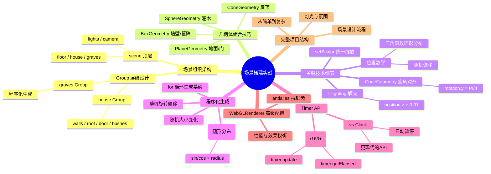

# Ch16 — 场景搭建实战：Haunted House

## 思维导图



---

## 1. 场景组织架构

大型场景需要良好的层级结构来保持代码可维护性。Haunted House 项目的层级设计：

```
scene
├── floor (PlaneGeometry)
├── house (Group)
│   ├── walls (BoxGeometry)
│   ├── roof (ConeGeometry)
│   ├── door (PlaneGeometry)
│   ├── bush1 (SphereGeometry)
│   ├── bush2 (SphereGeometry)
│   ├── bush3 (SphereGeometry)
│   └── bush4 (SphereGeometry)
├── graves (Group)
│   ├── grave[0] ... grave[29] (BoxGeometry)
├── ambientLight
├── moonLight (DirectionalLight)
├── axisHelper
└── camera
```

```ts
// 来自 ch16/src/main.ts
const house = new T.Group();
scene.add(house);

// 所有房屋组件添加到 house Group
house.add(walls);
house.add(roof);
house.add(door);
house.add(bush1, bush2, bush3, bush4);

// 坟墓独立为一个 Group
const graves = new T.Group();
scene.add(graves);
```

> **设计理念**：将相关联的对象放入同一个 Group。如果未来需要整体移动、旋转或隐藏房屋，只需操作 `house` Group 即可。

---

## 2. 基础几何体的组合运用

### 墙壁 (BoxGeometry)

```ts
const walls = new T.Mesh(
  new T.BoxGeometry(4, 2.5, 4),
  new T.MeshStandardMaterial({ color: "#a9c388" }),
);
walls.position.y = 2.5 / 2; // 让底部对齐地面
house.add(walls);
```

> **位置计算**：BoxGeometry 的中心在原点，所以要让底部贴地需要上移半个高度。

### 屋顶 (ConeGeometry)

```ts
const roof = new T.Mesh(
  new T.ConeGeometry(3.5, 1.5, 4), // 半径, 高度, 4边形底面
  new T.MeshStandardMaterial({ color: "red" }),
);
roof.position.y = 2.5 + 1.5 / 2;
roof.rotation.y = Math.PI / 4; // 旋转 45° 让棱角对齐墙壁角落
house.add(roof);
```

> **为什么旋转 45°？** `ConeGeometry` 的 4 边形底面默认棱角朝向坐标轴方向，而正方形墙壁的边也平行于坐标轴。旋转 45° 使屋顶的棱角对齐墙壁的角落，视觉上更自然。

### 门 (PlaneGeometry) 与 z-fighting

```ts
const door = new T.Mesh(
  new T.PlaneGeometry(2.2, 2.2),
  new T.MeshStandardMaterial({ color: "white" }),
);
door.position.y = 1;
door.position.z = 2 + 0.01; // ⚠️ +0.01 防止 z-fighting
house.add(door);
```

### 什么是 z-fighting？

当两个面完全重合（或极度接近）时，GPU 的深度缓冲区无法判断哪个在前面，导致两个面的像素交替闪烁，产生"条纹状"伪影。

**解决方案**：
- 将其中一个面微移（如 +0.01）
- 使用 `material.polygonOffset`
- 增大 near 裁剪面值以提高深度精度

### 灌木 (SphereGeometry + setScalar)

```ts
const bushGeometry = new T.SphereGeometry(1, 16, 16);
const bushMaterial = new T.MeshStandardMaterial({ color: "green" });

const bush1 = new T.Mesh(bushGeometry, bushMaterial);
bush1.scale.setScalar(0.5); // 统一缩放 xyz 为 0.5
bush1.position.set(0.8, 0.2, 2.2);
house.add(bush1);
```

> **`setScalar(s)` 等价于 `set(s, s, s)`**，用于等比缩放，代码更简洁。

---

## 3. 程序化生成：坟墓

通过循环和随机数程序化生成 30 个坟墓，环形分布在房屋周围：

```ts
const graveGeometry = new T.BoxGeometry(0.6, 0.8, 0.2);
const graveMaterial = new T.MeshStandardMaterial({ color: "pink" });

const graves = new T.Group();
scene.add(graves);

for (let i = 0; i < 30; i++) {
  const angle = Math.random() * Math.PI * 2;   // 随机角度 [0, 2π]
  const radius = 3 + Math.random() * 4;         // 随机半径 [3, 7]
  const x = Math.sin(angle) * radius;
  const z = Math.cos(angle) * radius;

  const grave = new T.Mesh(graveGeometry, graveMaterial);
  grave.position.x = x;
  grave.position.y = Math.random() * 0.4;       // 随机高度
  grave.position.z = z;
  grave.rotation.x = (Math.random() - 0.5) * 0.4; // 随机倾斜
  grave.rotation.y = (Math.random() - 0.5) * 0.4;
  grave.rotation.z = (Math.random() - 0.5) * 0.4;
  graves.add(grave);
}
```

### 环形分布的数学

```
x = sin(angle) × radius
z = cos(angle) × radius
```

- `angle` 在 `[0, 2π]` 范围随机 → 均匀分布在圆周上
- `radius` 在 `[3, 7]` 范围随机 → 保证在房屋外围（房屋宽度 4，半径 > 3）
- 随机旋转 → 模拟墓碑年久倾斜的自然效果

> **发散思考**：这种"随机角度 + 随机半径"的技术广泛应用于：
> - 树木/草丛的森林生成
> - 星空/粒子系统的分布
> - 城市建筑的程序化布局
> - 敌人刷新点的随机放置

---

## 4. Timer API (r163+)

ch16 使用了较新的 `THREE.Timer` 替代传统的 `THREE.Clock`：

```ts
const timer = new T.Timer();

const tick = () => {
  timer.update();                    // 必须每帧调用
  const elapsedTime = timer.getElapsed();

  controls.update();
  renderer.render(scene, camera);
  window.requestAnimationFrame(tick);
};
```

### Timer vs Clock

| 特性 | `Clock` | `Timer` (r163+) |
|------|---------|-----------------|
| 标签页不可见时 | 继续计时 | 自动暂停 |
| 使用方式 | `getElapsedTime()` 自动 | 需要手动 `update()` |
| 精度 | `Date.now()` | `performance.now()` |
| 推荐度 | 旧项目 | 新项目 |

> **为什么 Timer 更好？** 当用户切换标签页后再回来，Clock 的 `getElapsedTime()` 会包含后台暂停的时间，导致动画"跳跃"。Timer 的 `update()` 在不调用时不会累积时间。

---

## 5. WebGLRenderer 高级配置

```ts
const renderer = new T.WebGLRenderer({
  canvas,
  antialias: true, // 硬件抗锯齿
});
```

### antialias（抗锯齿）

`antialias: true` 启用多重采样抗锯齿（MSAA），平滑物体边缘的锯齿。

| 配置 | 效果 | 性能影响 |
|------|------|---------|
| `false`（默认） | 边缘有锯齿 | 无额外开销 |
| `true` | 边缘平滑 | 轻微性能消耗 |

> **注意**：`antialias` 只能在创建渲染器时设置，之后无法更改。在高 pixelRatio 设备上（如 Retina 屏），由于像素密度已经很高，抗锯齿效果不明显，可以考虑关闭以节省性能。

---

## 6. 场景搭建流程总结

1. **规划层级结构**：先在纸上画出对象树，明确哪些对象属于同一 Group
2. **搭建地面**：PlaneGeometry + 旋转 -90°
3. **构建主体**：从大到小，先墙壁、再屋顶、再细节
4. **解决位置对齐**：注意几何体原点在中心，需要计算 y 偏移
5. **添加程序化元素**：循环 + 随机数生成环境物体
6. **布光**：环境光打底 + 方向光做主光
7. **调试**：用 Tweakpane 实时调整参数直到满意

---

## 7. 相关面试/思考题

1. **如何避免 z-fighting？** 微调位置、使用 `polygonOffset`、减小 near/far 范围、或使用对数深度缓冲（`logarithmicDepthBuffer: true`）。
2. **为什么 `ConeGeometry(3.5, 1.5, 4)` 的第三个参数是 4？** 表示底面为 4 边形（方形），配合方形墙壁。如果设为 32 就是圆锥形屋顶。
3. **如何让场景更有"闹鬼"氛围？** 添加 Fog（雾效）、门口点光源模拟烛光闪烁、Ghost（鬼火）使用 PointLight 做路径动画、地面使用法线贴图增加纹理细节。
4. **程序化生成的墓碑如何避免与房屋重叠？** 通过设置 `radius >= 3`（大于房屋半宽 2）保证坟墓在房屋外围。更严谨的做法是加入碰撞检测，检查新位置是否与已有物体重叠。
